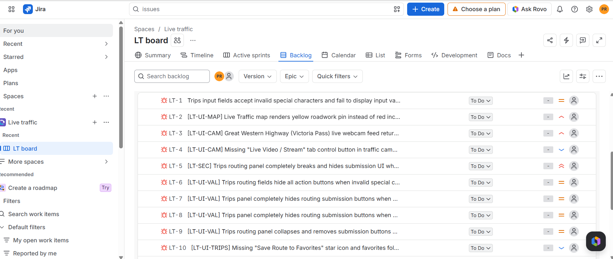
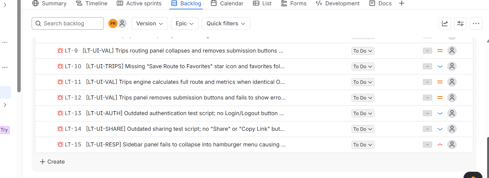

# Portfolio Case Study: Live Traffic Web Application QA Testing

## 📝 Project Overview
This repository documents the end-to-end verification, validation, and defect management lifecycle for a **Live Traffic web application**. 

The goal of this project was to perform comprehensive manual and functional UI testing on core system modules (Maps, Camera Feeds, and Trip Routing Panels) to ensure real-time accuracy, data integrity, and strict input validation. 

---

## 🛠️ Testing Stack & Environments
* **Test Management OS:** TestRail (Cloud Architecture)
* **Defect & Backlog Tracking:** Jira / Atlassian Agile Framework
* **Documentation Layout:** GitHub Markdown & Version Control

---

## 📈 Test Execution Analysis & Artifacts
The manual testing phase evaluated system resilience across various user actions and edge cases. Detailed metrics, execution charts, and pass/fail balances are archived directly within this repository:

* 📄 **Master Report Document:** [Live Traffic master report.pdf](./Live%20Traffic%20master%20report.pdf)
* 📊 **Raw Defect Database:** [Jira Defect Log](./Jira.csv)
* 💾 **TestRail XML Suite Backup:** [livetraffic_application_web_app.xml](./livetraffic_application_web_app.xml)

---

## 🐛 Defect Tracking & Bug Log (Sourced from Jira Platform)
All discovered functional and UI anomalies were documented, prioritized, and mapped into the active Jira backlog under the Project Key `LT`. 

### 🖼️ Active Board & Backlog Verification

### 📋 Detailed Defect Breakdown

Below is the verified registry of active defects captured during testing cycles:

| Ticket ID | Module / Component | Defect Summary & Observed Behavior | Priority |
|--- |--- |--- |--- |
| **LT-1** | Input Validation | Trips input fields accept invalid special characters and fail to display error messages. | High |
| **LT-2** | `[LT-UI-MAP]` | Live Traffic map renders yellow roadwork pin instead of the correct color classification. | Medium |
| **LT-3** | `[LT-UI-CAM]` | Great Western Highway (Victoria Pass) live webcam feed component layout breaks during stream loads. | High |
| **LT-4** | `[LT-UI-CAM]` | Missing "Live Video / Stream" tab control button in the regional traffic view interface. | Medium |
| **LT-5** | `[LT-SEC]` | Trips routing panel completely breaks and hides the submission interface on input failure. | High |
| **LT-6** | `[LT-UI-VAL]` | Trips routing fields completely hide all action buttons when invalid strings are processed. | High |
| **LT-7** | `[LT-UI-VAL]` | Trips panel completely hides routing submission buttons unexpectedly on form reset. | High |
| **LT-8** | `[LT-UI-VAL]` | Trips panel completely hides routing submission buttons unexpectedly on form reset. | Medium |
| **LT-9** | `[LT-UI-VAL]` | Trips routing panel collapses and removes all interactive text areas on invalid entry. | Medium |
| **LT-10** | `[LT-UI-TRIPS]`| Missing "Save Route to Favorites" control button option in user dashboard panel. | Low |
| **LT-11** | `[LT-UI-VAL]` | Trips engine calculates full route and pricing details even when parameters are incomplete. | Medium |
| **LT-12** | `[LT-UI-VAL]` | Trips panel removes submission button entirely instead of graying it out during entry. | Medium |
| **LT-13** | `[LT-UI-AUTH]`| Outdated authentication test script; multi-factor text logs trigger multiple validation fails. | Low |
| **LT-14** | `[LT-UI-SHARE]`| Outdated sharing test script; no "Share to Messaging Apps" button rendered in desktop mode. | Low |
| **LT-15** | `[LT-UI-RESP]` | Sidebar panel fails to collapse into hamburger navigation layout on narrow responsive screens. | High |

---

## 🔍 Core Test Scenarios Covered
To give context to the bugs found above, the test suite focused on two primary functional tracks:

### 🗺️ Track 1: Map Interactivity & Visual Assets
* **Scenario:** Verify map marker clusters accurately group high-density traffic incidents without overlapping.
* **Scenario:** Ensure live camera streams trigger correctly when selecting a corresponding road camera pin.

### 🚗 Track 2: Trip Routing & Input Fields
* **Scenario:** Validate form validation logic when users attempt to insert malicious injection scripts or special characters into the travel destination fields.
* **Scenario:** Ensure action buttons remain fully visible and interactable during standard layout resizing.

---

## 🚀 Future Roadmap: Test Automation
As Ramya suggested, this project serves as a concrete functional blueprint. The manual test steps and Jira parameters documented here will be leveraged in the next phase of development to build an automated regression testing engine utilizing **Playwright / Cypress** with JavaScript.
